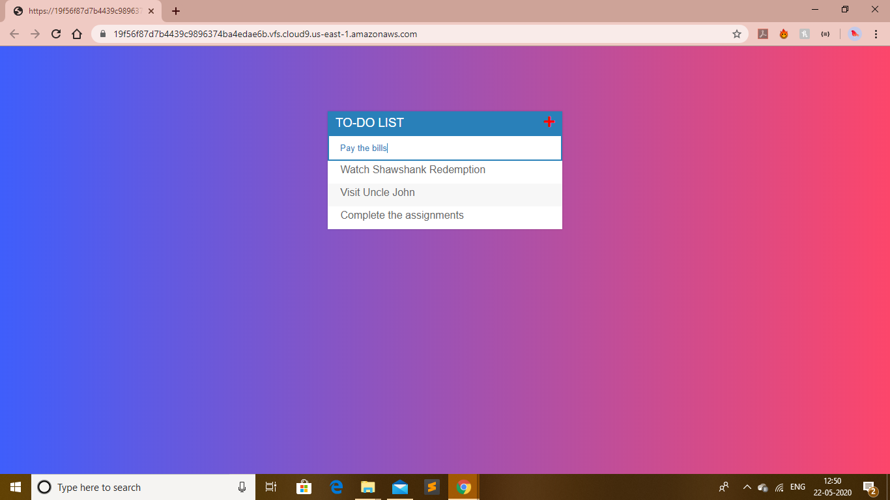
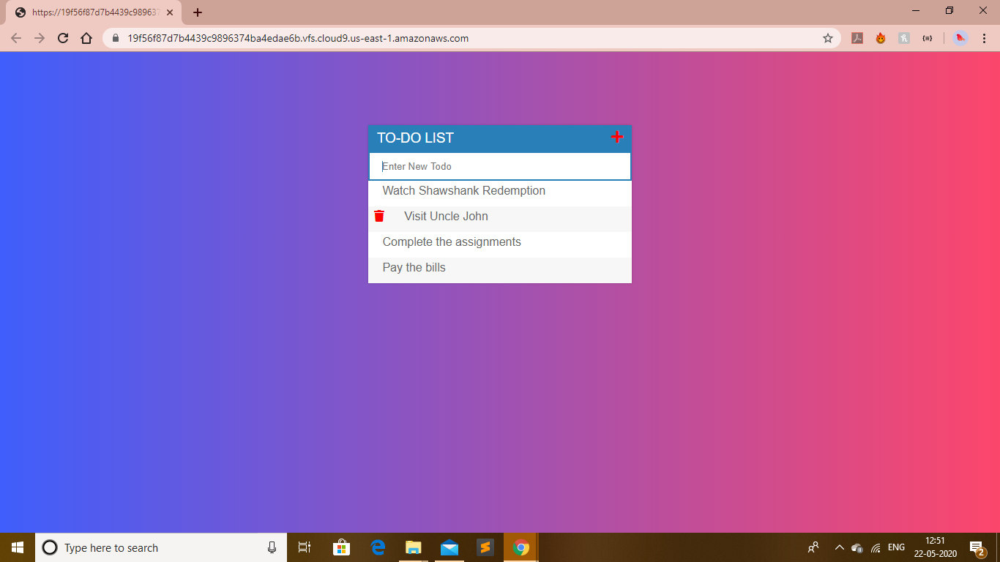
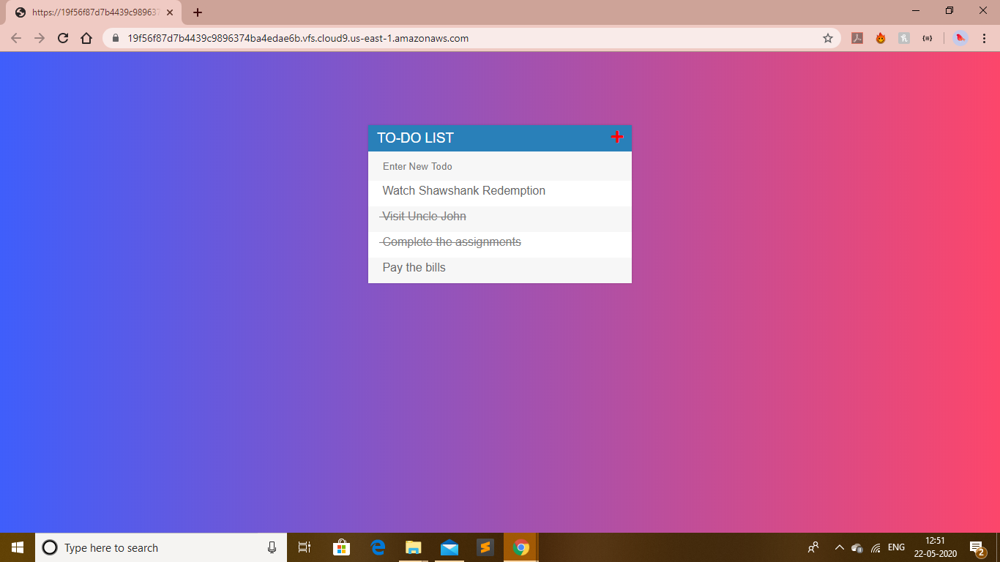

# TodoListProject
###A single page TODO list app using HTML,CSS,JS and monogoDB as database.
>
The app makes an ajax request to the TODOS-api and the JSON response is then used to display the todos.
>
 
 
 
 
